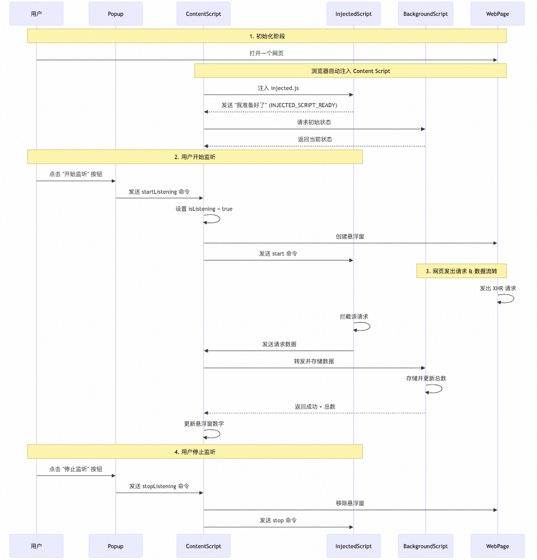
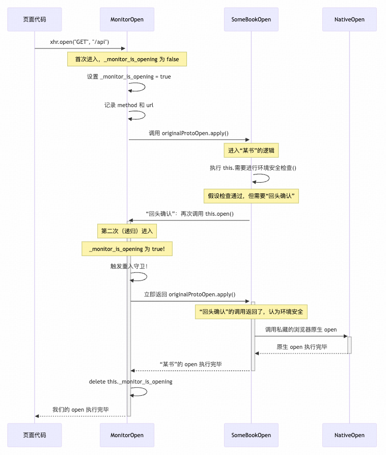

# MENG 接口监听器

一款为开发者设计的强大浏览器扩展，用于监控、审查和记录网页发出的所有 `XMLHttpRequest` 和 `Fetch` API 请求。它提供了一个无侵扰的悬浮窗和一个详细的请求查看器，旨在完美兼容那些会修改原生浏览器 API 的复杂单页应用。

## ✨ 功能特性

-   **实时拦截**: 即时捕获页面上的 `XMLHttpRequest` 和 `Fetch` 请求。
-   **页面悬浮窗**: 一个可拖动的、非侵入式的悬浮窗，实时显示捕获到的请求数量。
-   **请求详情查看器**: 一个专门的查看页面，让你能够审查每个请求的详细信息，包括 URL、方法、请求体和完整的响应内容。
-   **稳定且兼容**: 经过精心设计，以防止与其他同样会修改网络接口的脚本发生冲突，有效避免了无限递归等常见陷阱。
-   **会话级存储**: 所有捕获的数据都与当前标签页绑定，关闭标签页时会自动清除，确保了用户隐私且不会造成数据冗余。

## 🏗️ 架构概览



本扩展基于一个标准的四部分架构，这也是需要与网页进行深度交互的 Chrome 扩展所普遍采用的强大模式。

-   **`popup.js` (UI 控制器)**: 用户交互界面，用于开始/停止监控、清空记录和打开查看器。
-   **`content.js` (通信桥梁)**: 被注入到目标页面中。它扮演着桥梁的角色，负责与其他部分通信，并管理页面上的悬浮窗。
-   **`injected.js` (核心探针)**: 拦截逻辑的核心。它由内容脚本注入到页面自身的 JavaScript 上下文中，从而获得了修改 `XMLHttpRequest` 和 `fetch` 原型的必要权限。
-   **`background.js` (控制大脑)**: 扩展的后台服务。它管理全局状态，使用 `chrome.storage` 处理数据存储，并协调不同标签页之间的通信。

## 🛠️ 技术备忘：兼容性问题的解决方案

开发此工具最大的挑战是确保与现代复杂网页应用（如某书文档）的兼容性。这些应用本身也经常会修改或"修补" (Patch) 我们需要监控的浏览器 API，一个天真的实现会导致经典的"无限递归"问题。以下是我们解决这些边界问题的思路历程。

### 1. 核心问题：污染"纯净"对象导致的无限递归

我们发现，在拦截某书云文档接口时，会触发无限递归。其根本原因在于**对象所有权和意外的副作用**。

#### 破坏机制

大型框架通常不直接修改 `prototype`，而是采用**封装 (Wrapping)** 的方式。某书的逻辑可能如下：

1.  **创建封装器**: `new MoushuRequestManager()`。
2.  **内部实例**: 封装器内部创建并持有一个真正的 `xhr` 实例 (`this.internalXhr = new XMLHttpRequest()`)，并视其为"私有财产"。
3.  **代理方法**: 封装器对外提供 `.open()` 方法，内部实际调用 `this.internalXhr.open()`。

我们的代码通过修改 `XMLHttpRequest.prototype.open` 拦截了这个内部调用。在未添加守卫时，我们在 `this` (`internalXhr` 实例) 上添加了我们自己的监控属性 (`_monitor_method`, `_monitor_url`)。

这相当于我们绕过了主人 (`MoushuRequestManager`)，直接"污染"了它的私有财产。

#### 防御机制被触发

`MoushuRequestManager` 在调用完 `.open()` 后，可能会进行一次"健康检查"，例如：
*   **属性扫描**: 检查 `this.internalXhr` 的属性数量或结构是否符合预期。
*   **完整性校验**: 通过哈希等手段验证对象是否纯净。

当它发现我们添加的未知属性时，会认为实例被污染，状态不再可靠，于是触发重置或重新验证逻辑，再次调用 `open`，**从而导致死循环**。

#### 守卫如何解决

我们最终的"重入守卫"方案解决了这个问题：

```javascript
if (this._monitor_is_opening) {
  // 在重入检查时，不产生任何副作用
  return originalProtoOpen.apply(this, arguments); 
}
```
当守卫生效时（即发生重入调用），我们的代码**什么都不做**，不添加任何属性。这保证了 `MoushuRequestManager` 的"私有财产"的纯洁性，让它的健康检查得以通过，从而打破了循环。

### 2. 前置问题：页面脚本的执行顺序

上述问题的根源在于脚本的加载顺序。

**正确的顺序是：某书先运行，我们后运行。**

1.  **某书先上场**: 浏览器加载页面，作为页面主角的某书脚本 (`some_app_spa.js`) 先执行。它保存了浏览器**最原始**的 `open` 方法，并用自己的 `open_某书` 版本替换了它。
2.  **我们后上场**: 我们的扩展脚本后执行。我们保存的"原始方法"其实已经是被某书包装过的 `open_某书`。然后我们再用 `open_我们` 替换它。

这就形成了一个调用链：**`open_我们` -> `open_某书` -> `open_原始`**。

这个调用链本身是单向的，但无限递归是如何产生的呢？关键在于，`open_某书` 的内部逻辑有时会 **"回头"调用 `this.open()`**，而不是直接调用它私藏的 `原始_open`。这个"回头"的动作，使得调用流程再次回到了调用链的最顶端——我们的 `open_我们`，从而触发了循环。

**调用时序图解:**



### 3. 核心解惑：为什么它要"回头确认"？

这个"回头"的动作，并非无心之失，而是一种在复杂前端应用中常见的**防御性编程**。

**简化的伪代码猜测：**

```javascript
// 猜测的某书 open 方法内部逻辑
function open_某书(method, url, ...args) {
  
  // 决策点：检查某个内部状态，判断是否需要"回头确认"
  if (this.需要进行环境安全检查()) {
  
    // ... 可能在这里设置了一些重要的内部属性 ...
    
    // "回头确认"：它再次调用 this.open()，期待的是一个快速、无副作用的返回，
    // 以确认在它设置属性后，环境没有被其他脚本破坏。
    this.open(method, url, ...args); 
    return; 

  } else {

    // "继续前进"：检查通过，调用它自己私藏的、最原始的 open 方法办正事。
    原始_open.apply(this, arguments); 
  }
}
```

为更好地理解这个机制，伪代码中三个`open`的身份如下：
*   **`open_某书`**: "某书"自己封装的`open`版本。
*   **`this.open()`**: 对外的"公开调用"，用于触发环境安全检查。由于我们的插件最后加载，这个调用会命中我们的拦截器。
*   **`原始_open`**: "某书"私藏的浏览器"原生调用"，在安全检查通过后，用于执行真正的核心功能。

#### 附注："this" 的归属与方法的查找
一个核心困惑点是：`this` 明明是 `MoushuRequestManager` 内部的 `xhr` 实例，为什么 `this.open()` 调用的却是我们的函数？

这源于 JavaScript 的原型链方法查找机制。当 `this.open()` 被调用时：
1.  **`this` 的身份**：`this` 确实是"某书"代码创建的那个 `xhr` 实例。
2.  **方法的查找**：但 JavaScript 引擎为了找到 `.open` 这个方法，会沿着原型链向上查找。它首先在该实例自身上找，找不到，于是就去它的原型 `XMLHttpRequest.prototype` 上找。
3.  **"最后改写者"胜出**：由于我们的插件脚本最后执行，我们是最后一个修改 `XMLHttpRequest.prototype.open` 的代码。因此，挂载在原型上的 `open` 方法，其"指针"最终指向的是我们的 `open_我们` 函数。

所以，无论 `this` 指向哪个 `xhr` 实例，当它需要调用 `open` 方法时，最终通过原型链找到的都是我们挂上去的那个版本。

理解了"回头"动作的技术原理后，下一个自然的问题就是：某书的工程师为什么要设计这样一个看似增加了复杂度和风险的机制呢？

**原因分析**：
它不直接调用私藏的原始版本，是出于两个核心考量：1) **环境安全检查**：确保在它执行的瞬间，没有其他脚本正在干扰 `xhr` 对象。2) **逻辑统一**：确保所有请求，即使是它内部发起的，也遵循唯一的、标准的处理流程。

某书的工程师需要确保，在 `open` 到 `send` 之间，它设置在 `xhr` 实例上的重要属性（如 `token`、`headers`）没有被其他脚本（如广告、分析工具或其他扩展）意外地修改或清除。这个"回头确认"就是它的**环境安全检查**机制。

*   **没有我们守卫时**：我们的代码每次都"污染"了现场（添加了我们自己的属性），导致它的安全检查永远失败，所以它只能不断地重试，造成死循环。
*   **有了我们的守卫后**：在"回头确认"时，我们的守卫保证了"什么都不做"，现场是干净的。某书的检查得以通过，于是它就放心地调用最原始的 `open` 方法，整个调用链得以正常结束。

我们的守卫，本质上是**帮助并兼容了对方的防御机制**，而不是与之对抗。

### 4. 深度解惑：为什么 `_monitor_is_opening` 标志本身是安全的？

这是一个非常关键的问题：既然添加属性是一种"污染"，为什么添加 `_monitor_is_opening` 这个属性，就不会被上游框架（如"某书"）的防御机制视为"恶意污染"？

答案在于，上游框架的防御机制，其检查的重点很可能不是 **"环境当前是否有未知属性"**，而是 **"调用 `open` 这个行为是否会引入新的、非预期的副作用"**。

`_monitor_is_opening` 这一标志恰好帮助我们通过了这种**行为测试**：

1.  **区分状态数据与流程控制标志**：
    *   **`_monitor_method` / `_monitor_url`**：是**状态数据**。它们需要跨函数（从 `open` 到 `send`）存在，承载着核心业务信息。在 `open` 阶段就植入这类数据，更容易被视为一种有风险的"污染"。
    *   **`_monitor_is_opening`**：是一个**流程控制标志**。它的生命周期极短（"阅后即焚"），不携带业务数据，其唯一作用就是给我们的代码自己看，用于斩断递归，避免无限循环。

2.  **通过"回头确认"的行为测试**：当上游框架注意到环境异常（或 `open` 被重写），它发起"回头确认"调用，本质是在进行一次**安全行为测试**。
    *   **测试前**：环境可能已被我们的首次调用"污染"（存在 `_monitor_is_opening` 等属性）。
    *   **测试中**：它再次调用 `this.open()`。此时，我们的守卫被触发，函数**无副作用**（不添加或修改任何属性）且**快速返回**。
    *   **测试结论**：`open` 函数虽然被替换，但其递归调用行为是**幂等且良性的**，不会引入进一步的污染。测试通过。

3.  **信任但有风险的君子协定**：我们的代码能够运行，最终是建立在一个双向的信任基础上的：
    *   **我们对上游的信任**：我们必须相信，上游框架（如"飞书"）遵循了基本的软件设计原则。它的 `open` 方法作为一个整体，对外必须是**"无状态破坏性的"**。即，它内部的安全检查，无论采用何种机制（如快照对比或临时删除恢复），都不能永久性地破坏 `XMLHttpRequest` 对象上由其他脚本设置的、需要传递到 `send` 阶段的状态。如果它违反了这一原则，那么不仅是我们的插件，它自身的业务逻辑也很可能崩溃。
    *   **上游对我们的信任**：我们也必须表现得像一个"良好市民"。我们的守卫逻辑，恰恰是在向上游框架证明：我们的代码是"良性"的，不会在它的安全检查期间引入意外的副作用。

    因此，`_monitor_is_opening` 不仅不是"恶意污染"，反而是我们向外部环境证明自身"品行良好"的关键工具，是我们得以在这个信任协定下生存的"通行证"。

### 5. 君子协定 vs 主动欺骗

既然我们理解了它的防御机制，能否主动"欺骗"并绕过它？某书的防御是否本身就不完善？

**关于"主动欺骗"**

理论上，我们完全可以做到。我们可以在记录完 API 调用后，再小心地抹除掉所有我们添加在 `xhr` 对象上的属性（包括我们的守卫标记），将一个"干净"的对象交还给某书的脚本。这就像一个高明的间谍，在完成任务后将现场恢复原状。

但我们选择了**不这么做**。因为这种"主动欺骗"会使我们的扩展与某书的内部实现**过度耦合**。一旦某书更新，调整了它的检查逻辑，我们的扩展就可能立刻失效。

我们当前的"重入守卫"方案，更像是一种**君子协定**式的**被动兼容**。它不对对方的内部实现做任何假设，只遵循"凡是重入，皆为可疑，直接放行"的通用原则。这使得我们的方案更加健壮，维护成本也更低。

**关于某书防御的"不完善"**

某书的防御机制在"健康检查失败"后的降级策略存在缺陷。其无限重试行为，是基于一种乐观但天真的假设——即外部干扰是瞬时的，多试一次可能就会恢复正常。

这个策略的根本问题是缺少"熔断"机制：它没有设置重试上限。在面对我们插件这种持久性的"干扰源"时，便会陷入无限递归，最终导致页面崩溃。因此，这并非一个健壮的设计。

## 🚀 如何安装

1.  克隆或下载此仓库的 ZIP 文件并解压。
2.  打开 Chrome 浏览器并导航至 `chrome://extensions`。
3.  打开右上角的"开发者模式"开关。
4.  点击"加载已解压的扩展程序"按钮。
5.  选择刚刚解压的项目文件夹。现在"MENG 接口监听器"应该会出现在你的扩展列表中。 